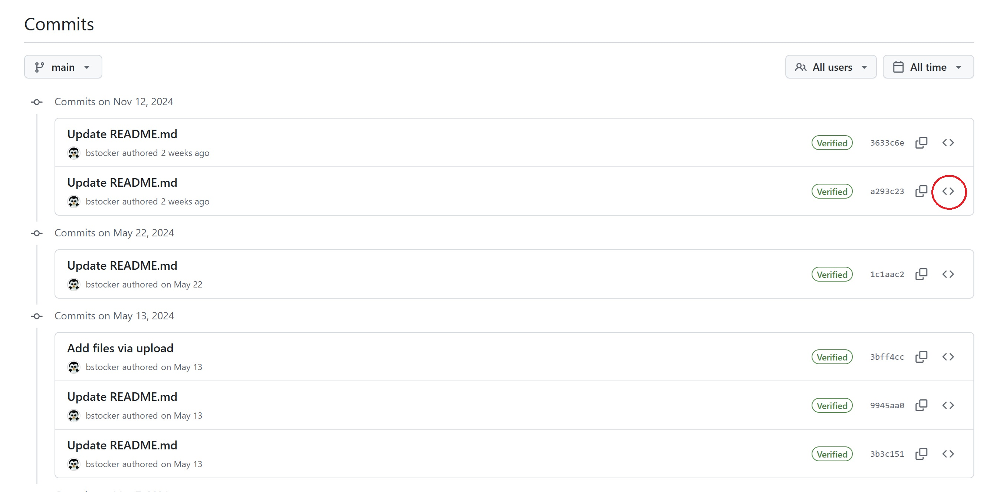
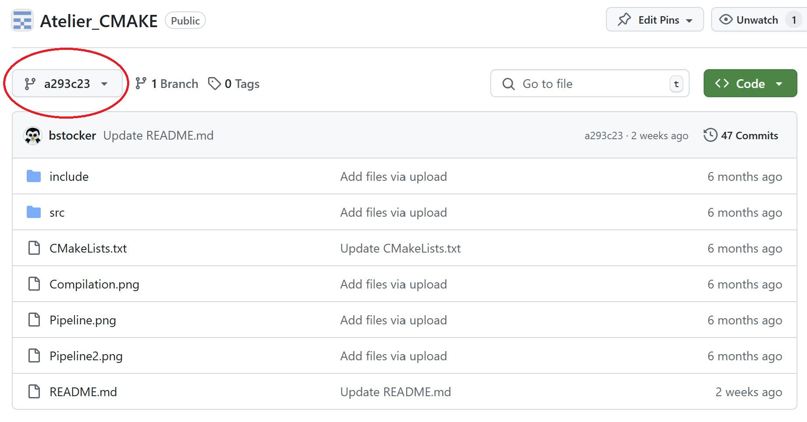
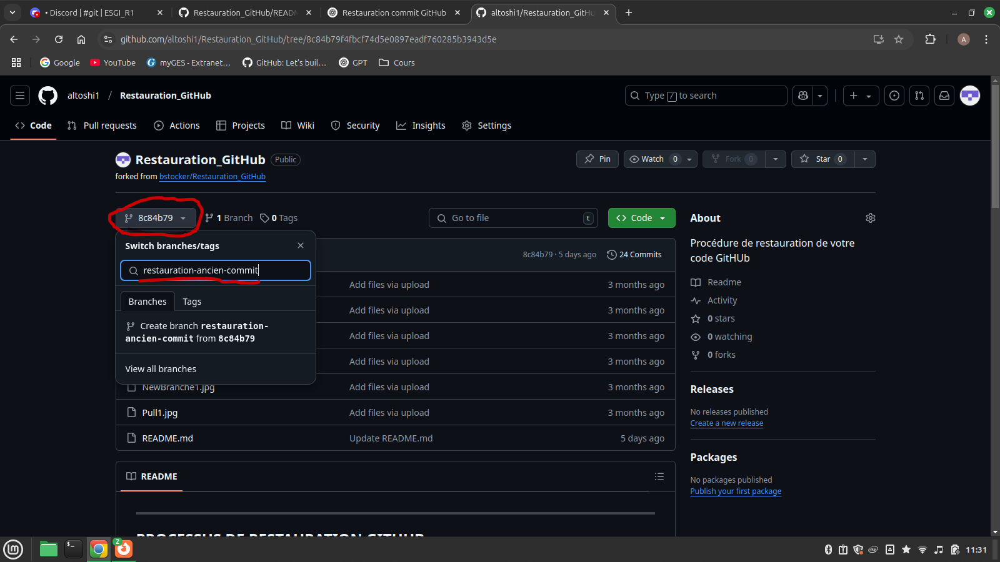
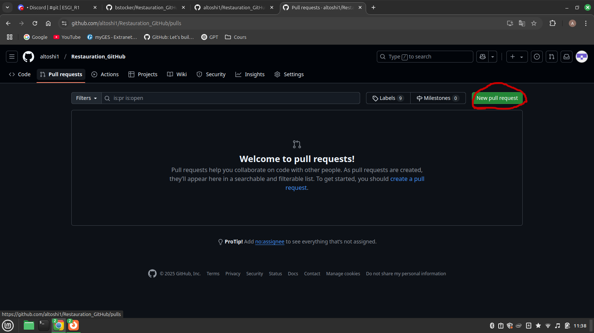
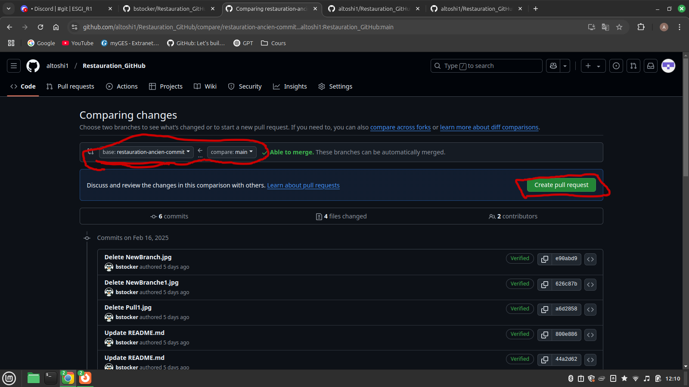
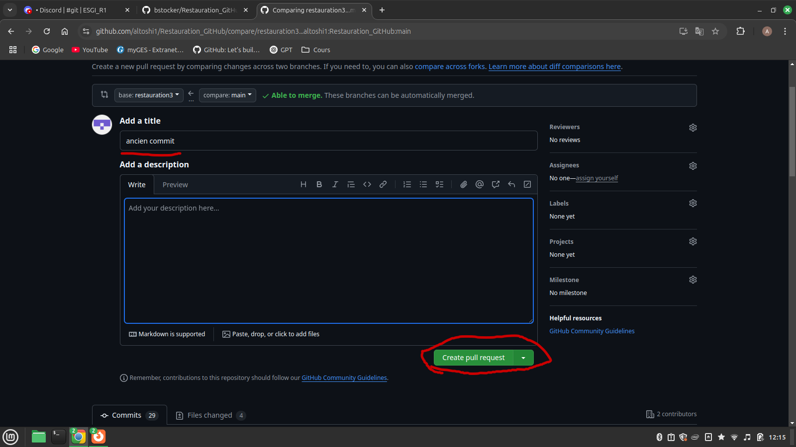
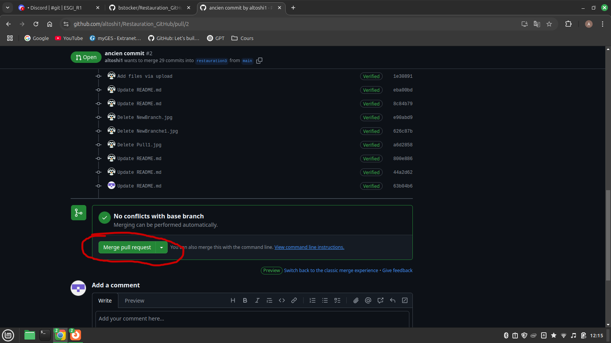
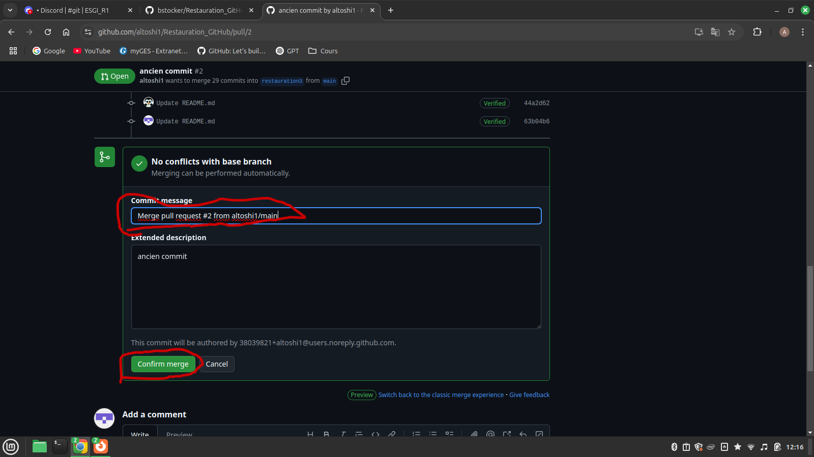
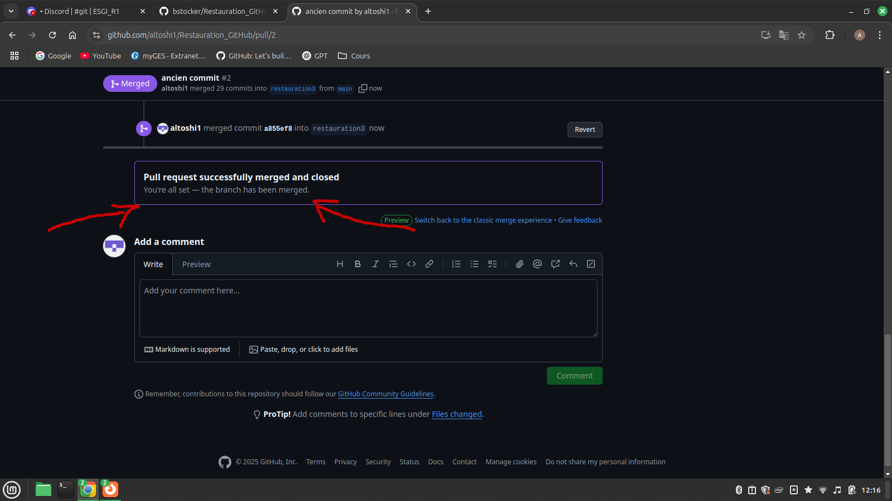

------------------------------------------------------------------------------------------------------
PROCESSUS DE RESTAURATION GITHUB
------------------------------------------------------------------------------------------------------
Suite à une modification de code dans GitHub, votre solution ne fonctionne plus. Vous devez donc restaurer votre code mais comment faire.  

**Exercice :** Ecrire dans ce Readme une procédure pour expliquer étape par étape le processus de restauration d'un code issue de votre historique (vos commits). C'est dire, décivrez comment faire un Checkout depuis l'interfaçe GitHub. Vous trouverez ci-dessous le début de la séquence de restauration.  

-------------------------------------------------------------------------------------------------------
Début de procédure : Historique des commits
-------------------------------------------------------------------------------------------------------
L'historique de vos commits vous donne accès à vos différentes versions de votre code.  
A chaque commit, un point de sauvegarde est créé dans GitHub.  

Cliquez sur Commits pour accèder à votre historique de commits  
  
   

Sélectionnez la sauvegarde que vous souhaitez restaurer.  

   

A présent vous n'êtes plus dans votre branche main (branche principale) mais vous naviguez dans un point de restauration (votre code du passé).  

   

Créer une branche depuis le commit
Dans l’onglet “Code”, cliquez sur le menu des branches (ici “8c84b79”) et tapez le nom de votre nouvelle branche.

Ouvrir un nouvel onglet “Pull requests”
Allez dans l’onglet “Pull requests” et cliquez sur le bouton “New pull request”.

Comparer la branche avec ‘main’
Sélectionnez votre branche (“restauration-ancien-commit”) comme base, “main” comme branche à comparer, puis cliquez sur “Create pull request”.

Donner un titre et créer la pull request
Indiquez un titre (ex: “ancien commit”), ajoutez une description si nécessaire, puis validez avec “Create pull request”.

Vérifier qu’il n’y a pas de conflits
GitHub affiche “No conflicts with base branch”, ce qui signifie que la fusion peut se faire automatiquement.

Fusionner la pull request
Cliquez sur “Merge pull request”, modifiez éventuellement le message de commit, puis confirmez avec “Confirm merge”.

Pull request fusionnée
Un message de confirmation s’affiche (“Pull request successfully merged and closed”), indiquant que tout est terminé.

